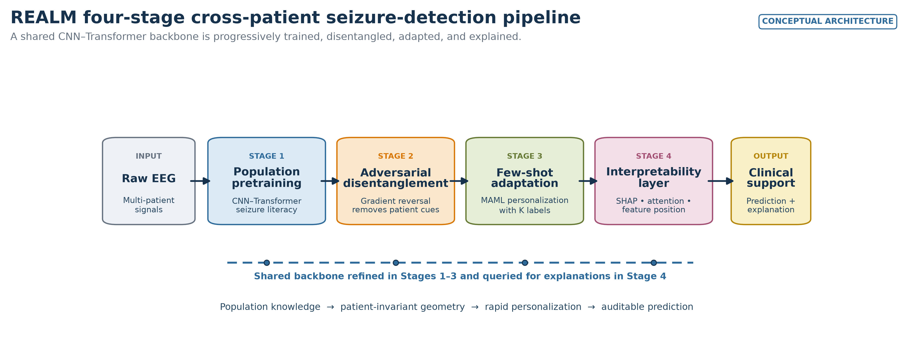

# REALM EEG

Reference implementation of **REALM — Robust EEG Adaptation via meta-Learning and
disentanglement Modules** — a proposed four-stage framework for cross-patient seizure
detection.

> **Research prototype only.** The accompanying manuscript reports a methodological
> framework, not empirical validation. This repository is not a medical device, must not be
> used for diagnosis or patient care, and contains no clinical data or trained weights.



## What is implemented

1. **Population pretraining:** a configurable 1D CNN–Transformer backbone and binary seizure
   head.
2. **Patient disentanglement:** a patient classifier connected through a gradient reversal
   layer (GRL) with a smooth coefficient schedule.
3. **Few-shot adaptation:** patient-as-task support/query episodes, first-order MAML, and
   adaptation of a copied model for an unseen patient.
4. **Interpretability:** integrated gradients, optional SHAP, transformer attention rollout,
   and distances to seizure/non-seizure latent centroids.

The code also includes channel harmonization, resampling, optional filtering, patient-level
splitting, binary metrics, false-alarm events per hour, checkpointing, and a synthetic
end-to-end smoke test.

This is an executable **library scaffold**, not a turnkey clinical-dataset trainer. The CLI
validates the neutral data contract and runs a synthetic integration test; empirical studies
must supply a dataset-specific adapter, locked patient split, run orchestration, and model-
selection policy in accordance with the documented contracts.

## Quick start

Python 3.10 or newer is required.

```bash
python -m venv .venv
source .venv/bin/activate
python -m pip install --upgrade pip
python -m pip install -e .
realm-eeg synthetic-demo --output realm-demo
```

The demo creates generated, non-clinical EEG-like windows, holds out one complete patient,
runs all training stages, adapts to the held-out support set, and writes:

- `demo-config.json`
- `demo-explanation.npz`
- `demo-metrics.json`
- `realm-stage1-synthetic.pt`
- `realm-stage2-synthetic.pt`
- `realm-synthetic-demo.pt`
- `synthetic-windows.npz`

Its metrics are a software smoke test only and are not scientific evidence.

Validate a prepared dataset without training:

```bash
realm-eeg validate-npz /path/to/windows.npz
```

## Input contract

The neutral interchange format is a NumPy `.npz` file with three required non-object arrays
and an optional all-or-none temporal metadata trio:

| Key | Shape | Meaning |
|---|---|---|
| `x` | `[windows, channels, samples]` | finite, preprocessed EEG windows |
| `y` | `[windows]` | binary labels: 0 non-seizure, 1 ictal |
| `patient_id` | `[windows]` | integer patient identifier |
| `recording_id` | `[windows]` | optional non-negative integer recording identifier |
| `group_id` | `[windows]` | optional non-negative integer recording/session or temporal-block identifier |
| `window_start_seconds` | `[windows]` | optional finite, non-negative start within a recording |

Patient identifiers must be split before any window-level sampling. Never allow one patient
to appear in more than one train/validation/test partition. Dataset acquisition and adapter
guidance is in [docs/DATASETS.md](docs/DATASETS.md).

Include all three optional arrays whenever Stage 3 grouped episodes or continuous-timeline
false-alarm metrics will be used. The loader rejects a partial trio so that required leakage
and timing metadata cannot disappear silently.

Compressed NPZ is for interchange and modest datasets. For clinical-scale local arrays, use
the memory-mapped `NPYDirectoryDataset` format documented in the dataset guide.

## Reproduce the reference workflow

```bash
python -m pip install -e '.[dev,explain,eeg]'
pytest
python scripts/generate_figures.py
```

The manuscript leaves many engineering details unspecified. The values in
[`configs/reference.json`](configs/reference.json) are documented reference choices, not
claimed manuscript hyperparameters. The exact stage semantics and resolved ambiguities are
recorded in [docs/FRAMEWORK.md](docs/FRAMEWORK.md) and the reproducibility protocol is in
[docs/REPRODUCIBILITY.md](docs/REPRODUCIBILITY.md).

## Repository map

```text
src/realm_eeg/              model, training, adaptation, metrics, explanations
configs/reference.json      explicit reference defaults
docs/                       framework, dataset, governance, figures, and tables
scripts/generate_figures.py deterministic figure and source-data generator
tests/                      unit and integration tests
```

The manuscript-derived architecture diagrams, simulated/illustrative visuals, captions, alt
text, and source-data provenance are indexed in [docs/FIGURES.md](docs/FIGURES.md). Both
manuscript tables are available as readable Markdown and machine-readable CSV in
[docs/TABLES.md](docs/TABLES.md). No manuscript draft or identifying title page is included.

## Responsible use

- Preserve the terms and citations of every source dataset; datasets are not sublicensed by
  this repository.
- Treat explanations as model diagnostics, not proof of physiological causality.
- Report performance by held-out patient with confidence intervals and alert burden, not only
  pooled window accuracy.
- Audit subgroup coverage, missing channels, annotation quality, calibration, and patient-ID
  leakage before drawing scientific conclusions.
- Keep protected health information, raw EEG, split manifests, and checkpoints out of public
  version control unless release is explicitly authorized.

See [MODEL_CARD.md](MODEL_CARD.md), [docs/DATA_GOVERNANCE.md](docs/DATA_GOVERNANCE.md), and
[SECURITY.md](SECURITY.md) before using real data.

## Citation and licensing

Software release metadata is in [CITATION.cff](CITATION.cff). The manuscript should be cited
as unpublished until a persistent publication identifier is available.

Canonical source repository: [github.com/ZaneSalman/realm-eeg](https://github.com/ZaneSalman/realm-eeg)

Code is licensed under Apache-2.0. Documentation, generated figures, tables, and figure
source-data CSVs are licensed under CC BY 4.0; see [NOTICE](NOTICE) and
[LICENSES](LICENSES/CC-BY-4.0.txt). No license is granted for third-party EEG datasets.
